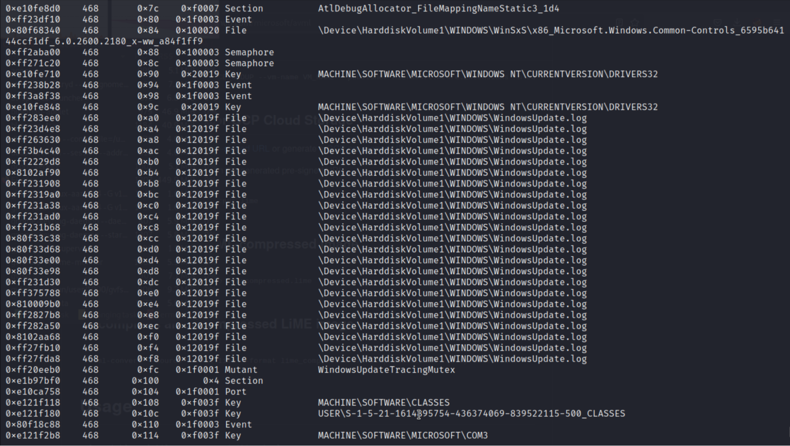
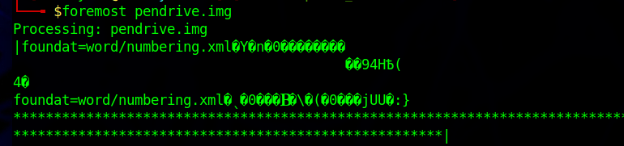

# Projekt z przedmiotu Informatyka Śledcza

## Jakub Młocek

[ETAP 1 - Tworzenie maszyny wirtualnej](#h.cv3xetknqfrf)        [3](#h.cv3xetknqfrf)

[ETAP 2 - Analiza otrzymanej maszyny](#h.nc2fapf0vzb)        [4](#h.nc2fapf0vzb)

[ETAP 3 - Metadane (Exiftool)](#h.kyic563rsihg)        [21](#h.kyic563rsihg)

[ETAP 4 - Analiza pamięci ram](#h.mwu6ezzfe8ln)        [24](#h.mwu6ezzfe8ln)

[ETAP 5 - Odzyskiwanie usuniętych danych](#h.pgo76uf14dip)        [32](#h.pgo76uf14dip)

ETAP 1 - Tworzenie maszyny wirtualnej
=====================================

Instalacja programów:
---------------------

*   Google  chrome
*   Skype
*   Odinstalowanie Skype
*   CCleaner
*   Virtualbox

Założenie kont użytkownika:
---------------------------

*   zalozenie konta email na onet.pl: miesisty@buziak.pl Miesistybuziaczek123$
*   zalozenie konta email na gmail.com: miesistybuziaczek@gmail.com Miesistybuziaczek123$
*   Zapisanie haseł do kont w hasłach google chrome

Przeglądarka WWW:
-----------------

*   Szukanie ciekawych lokalizacji wakacyjnych w google maps
*   Instalacja wtyczek (GC Dark Mode Minimalist oraz AdBlock)
*   Dodanie zakładek docker oraz tanieorzechy
*   Wyszukiwanie promocji na wakacje 2023
*   Wyszukiwanie jak używać aplikacji virtualbox
*   Używanie dokumentów google na założonym koncie
*   Pogoda w krakowie
*   Wyszukiwanie Instalacja Docker

Pliki:
------

*   Pobranie ciekawezadania.txt
*   Pobranie ciekawezadania.doc
*   Pobranie ciekawezadania.pdf
*   Pobranie tapeciarnia.pl-155804\_traktor\_pole.jpeg
*   Pobranie ccsetup606\_pro\_trial
*   Pobranie Skype-8.92.0.204
*   Pobranie VirtualBox-5.2.44-139111-Win
*   Pobranie 8 zdjęć własnych z metadanymi z różnych miejsc do analizy
*   Usunięcie 3 z pobranych zdjęć w tym jednego również z kosza systemowego
*   Pobranie DockerDesktopInstaller.exe
*   Usunięcie DockerDesktopInstaller.exe również z kosza systemowego
*   Utworzenie 2 folderów na pulpicie i usunięcie jednego

Zmiana ustawień systemowych:
----------------------------

*   Ustawienie tapety na plik: tapeciarnia.pl-155804\_traktor\_pole.jpeg
*   Utworzenie konta użytkownika tajniak z włączoną kontrolą rodzicielską na używanie komputera w poniedziałek, środę oraz niedzielę
*   Zmiana regionu na RPA
*   Wyłączenie zapory systemu windows

Konwersja pliku wirtualnego dysku vdi do formatu raw:
-----------------------------------------------------

ETAP 2 - Analiza otrzymanej maszyny
===================================

Wnioski po przygotowaniach do rozpoczęcia analizy:
--------------------------------------------------

Przygotowanie środowiska do rozpoczęcia analizy pokazało mi jak ważne jest technologiczne zaplecze w tej dziedzinie. Prywatnie korzystam z Macbooka Air M1, na którym wykorzystywanie wirtualnych maszyn jest niestety mocno utrudnione. W związku z powyższym zdecydowałem się na wykorzystanie mojego poprzedniego laptopa na którym był zainstalowany zarówno system Parrot OS jak i Windows 10. Wybór padł na system windows, ponieważ według wielu forów lepiej współpracuje z narzędziem Autopsy. Wiele problemów spowodował również zbyt mały dysk (jedynie 128gb SSD), który zapełnił się cały po wyeksportowaniu obrazu maszyny wirtualnej. Z powodu braku dysku zewnętrznego zmuszony zostałem wspierać się pendrivem o zbliżonej pojemności, jednak znacznie niższych prędkościach dostępu do danych. Wszystko to powodowało, że przygotowanie środowiska zajęło niespodziewanie dużo czasu.

Informacje o systemie operacyjnym:
----------------------------------

*   Analizowany obraz jest obrazem systemu Windows 7 Home Premium Service Pack 1
*   Nazwa komputera to: SUPERKOMPUTER

Rozkład partycji na dysku:
------------------------------------------------

Historia wyszukiwania z przeglądarki:
-----------------------------------------------------------------------------------

Z historii internetowej można wiele dowiedzieć się o danej osobie. W naszym przypadku możemy przypuszczać, że mamy osobę studiującą na uczelni AGH (agh, sylabus agh), zainteresowaną zagadnieniami informatycznymi, a w szczególności cyberbezpieczeństwem (niebezpiecznik, tryhackme, cybersecurity roadmap, kleopatra)

Zakładki internetowe
--------------------

Wszystkie znalezione zakładki, są domyślnymi zakładkami systemowymi. Ponadto są one znalezione w wyszukiwarce Internet Explorer, a jak wynika z dalszej analizy systemu użytkownik zainstalował oraz używał przeglądarki Google Chrome.

Pliki pobrane z internetu:
--------------------------

Wśród pobranych przez użytkownika plików z wykorzystaniem przeglądarki Google Chrome widnieją:

*   Pliki graficzne:

*   pies1.jpg

*   pies2.jpg

*   pies3\_zly,jpg

*   pies4.jpg

                        

*   roadmap.jpg

*   Wnioski z plików graficznych: Użytkownik prawdopodobnie lubi zwierzęta w szczególności psy. Mogłoby to zostać wykorzystane w celu ataku phishingowego. Użytkownik również ma pobraną mapę rozwoju w zakresie cyberbezpieczeństwa, więc może zaczynać interesować się tym tematem.

*   Pliki exe:

*   icy-tower-1-5-1.exe
*   gpg4win.exe
*   winrar.exe
*   Chromesetup.exe

Wnioski: Wszystkie powyższe pliki są plikami instalacyjnymi programów użytkowych. Co ciekawe jedynie icy-tower nie znajduje się wśród zainstalowanych programów. Być może nie został zainstalowany, lub został odinstalowany przed utworzeniem kopii dysku.

Zainstalowane programy:
-----------------------

Z widocznych programów możemy wyróżnić:

*   WinRAR
*   Notepad++
*   Gpg4Win (co sugeruje że obecne na dysku mogą być również klucze pgp)
*   Oracle VM VirtualBox Guest Additions (co sugeruje, że mamy do czynienia z obrazem maszyny wirtualnej)
*   Google Chrome

Wnioski:

Urządzenie nie było nadmiernie eksploatowane. Znajdują się na nim jedynie podstawowe programy do codziennej pracy (Z wyjątkiem Gpg4win).

Pozostałe interesujące zdjęcia znajdujące się na dysku:
-------------------------------------------------------

Zauważyć możemy wiele plików .jpg, które nie zostały pobrane z internetu, a prawdopodobnie przeniesione bezpośrednio z telefonu. Możemy zobaczyć, że użytkownik najprawdopodobniej używa telefonów marki Apple: IPhone 8 oraz IPhone 12 mini

Używając funkcji Geolocation w autopsy możemy za pomocą powyższych zdjęć dowiedzieć się więcej o prywatnym życiu użytkownika systemu:

*   IMG\_7342.jpg:

Powyższe zdjęcie zrobione zostało w restauracji w miejscowości Dąbrowa Tarnowska. Po chwili wyszukiwania w internecie udało się odkryć że obiad ten był zamówiony w restauracji Bonum Good Food.

*   IMG\_7932.jpg:

Zdjęcie przedstawia regał sklepowy, a jego lokalizacja jest zbliżona do zdjęcia IMG\_7342.jpg Data wykonania jest natomiast miesiąc poźniejsza niż poprzedniego zdjęcia. Wskazywać to może, że w tamtym okresie (08/09.2021) użytkownik mieszkał w okolicach w których wykonane zostały oba zdjęcia.

                

*   Interesujące wnioski możemy również pozyskać ze zdjęć: IMG\_6926.jpg oraz IMG\_6904.jpg Zdjęcie IMG\_6904.jpg zostało wykonane o godzinie 9:47 dnia 23.09.2022 na wysokości miasta Poznań i przedstawia skrzydło lecącego ponad chmurami samolotu marki wizzair. Zdjęcie IMG\_6926.jpg zostało natomiast wykonane tego samego dnia o godzinie 17:02 na chodniku w Warszawie. Z kombinacji tych dwóch zdjęć możemy wyciągnąć wnioski, że dnia 23.09.2022 użytkownik wracał z wyjazdu zza zachodniej granicy Polski. Wiadomo również, że leciał samolotem marki wizzair. Za pomocą powyższych informacji dałoby się ustalić dokładny numer lotu, którym podróżował użytkownik.

*   Zdjęcie IMG\_5229.jpg daje nam już pełny widok na poprzednie 2 zdjęcia. Zostało ono zrobione dnia 20.09.2022 w Paryżu. To stamtąd więc prawdopodobnie lotem powrotnym wracał użytkownik dnia 23.09.2022.

*   Ostatnim interesującym zdjęciem znalezionym na dysku jest IMG\_8140.jpg Zostało ono zrobione dnia 03.10.2021 w Krakowie. Niestety nie jest ostre i nie znamy kontekstu więc nie można z niego wyciągnąć dalszych wniosków.

*   Pozostałe zdjęcia znalezione na komputerze to zdjęcia systemowe. Nie zawierają one żadnych interesujących metadanych.

Wnioski:

Jak widać na powyższych przykładach mając kilka zdjęć powiązanych ze sobą i zrobionych w niedużych odstępach czasu, jesteśmy w stanie wiele dowiedzieć się o życiu/podróżach właściciela. Często można z takich zdjęć wysnuć daleko idące i być może groźne dla użytkownika wnioski. W naszym przypadku można próbować przygotować mail phishingowy w związku z odbytym lotem linią Wizzair - dostępnych dla nas informacji wydaje się aż nadto.

Drzewo Katalogów:
-----------------

Użytkownik stworzył na pulpicie wiele nowych katalogów takich jak:

*   jpg z neta
*   jpg z telefonu
*   inne
*   pliczki
*   studia

Część z nich zawiera również podkatalogi. Pliki zawierające się w folderach ze zdjęciami zostały omówione w poprzednich sekcjach. W folderze Studia oraz jego podkatalogach nie znajdują się żadne pliki. W folderze pliczki znajdują się natomiast 3 pliki .txt:

Znalezione pliki .txt
---------------------

*   txt1.txt:

*   txt2\_notepad.txt

*   doc1.txt:

Konta na które logował się użytkownik:
--------------------------------------

Wygląda na to, że użytkownik zastanawiał się między stworzeniem konta pocztwoego na portalu interia.pl a wp.pl Ostatecznie zostało założone konto o nazwie użytkownika jan.kowalik23 na serwisie interia.pl

Z sekcji Web Form Autofill wygenerowanego raportu możemy dowiedzieć się jeszcze więcej prywatnych informacji. Widzimy, że jeśli zostało utworzone na prawdziwe dane, to naszym użytkownikiem jest Jan Kowalski, urodzony w 1999 roku. Dodatkową informacją która prawdopodobnie nie została umieszczona na maszynie celowo jest numer indeksu osoby która ją utworzyła zawierający się w jej mailu uczelnianym.

Timeline
--------

Zielone kolumny oznaczają aktywność użytkownika w internecie. W interesującym nas obszarze czasu jest ona widoczna w dniach 07.12.2022 oraz 08.12.2022.  Wnioskować możemy z tego, że prawdopodobnie w tych datach została utworzony obraz analizowanej przez nas maszyny wirtualnej.

Podpięte urządzenia USB:
------------------------

Podczas pracy na systemie użytkownik nie używał żadnych interesujących urządzeń.

Klucze GPG
----------

W wcześniej zebranych danych wynikało, że użytkownik zainstalował na systemie program Gpg4win. W raporcie z programu Autopsy, udało się znaleźć lokalizacje utworzonych kluczy (C:\\Users\\projekt\\Studia\\Semestr 2\\klucz poufny.asc), jednak z niewiadomych powodów nie były one widoczne z poziomu wyników analizy. Nie udało mi się w żaden sposób  dostać do tych plików więc ich dalsza analiza była niestety niemożliwa.

ETAP 3 - Metadane (Exiftool)
============================

### Przygotowanie:

Do analizy przygotowałem 3 zdjęcia zrobione podczas mojej górskiej turystyki:

IMG\_1278.jpg:

IMG\_8747.jpg, a poniżej IMG\_8852.jpg

### Analiza:

Zaczynając od zdjęcia IMG\_1278.jpg:

Jak możemy zauważyć ukazało nam się wiele interesujących informacji. Do najważniejszych i najgroźniejszych zaliczyłbym dokładne koordynacje GPS miejsca w którym zdjęcie zostało utworzone, datę utworzenia oraz model telefonu/aparatu którym zdjęcie zostało zrobione. W przypadku tego zdjęcia znalezione koordynaty GPS to: 49 deg 32' 12.15" N, 19 deg 19' 29.05" E. Bez problemu możemy znaleźć szukane miejsce za pomocą map google. W tym przypadku jest to miejsce w rejonie szczytu Pilsko, poza trasą zjazdową.

Zostało ono zrobione dnia 2021:01:15 o godzinie 12:23:53.451+01:00, przez telefon iPhone X back dual camera 4mm f/1.8. Zapisane mamy również dokładne informacje o matrycy jak i rozdzielczości samego obiektywu.

Pozostałe 2 zdjęcia przeanalizowałem analogicznie. Zostały one zrobione innym telefonem (iPhone XS back dual camera 4.25mm f/1.8) Dla IMG\_8852.jpg data utworzenia to: (2022:12:27 13:11:56.233+01:00) a lokalizacja (49 deg 40' 59.37" N, 18 deg 49' 11.51" E). 

Jest to górna stacja kolejki krzesełkowej na czantorię.

### Modyfikacja:

Za pomocą narzędzia exiftool możemy również modyfikować zawartości metadanych. doanie flagi -exif:”nazwa wartosci”=”wartość” możemy zmienić dowolny parametr. Dla przykładu w zdjęciu IMG\_8852.JPG zmieniłem Lens ID na Dziwny obiektyw śledczy.

Dowolna osoba próbująca wydobyć metadane po tej zmianie dostanie jedynie nową zawartość.

ETAP 4 - Analiza pamięci ram
============================

Analizie zostanie poddany zrzut pamięci ram przygotowany przez prowadzącego - memory3.vmem

### Image Info and KDBGScan

Pierwszym etapem analizy zrzutu pamięci jest odpowiedzenie na pytanie z jakim systemem operacyjnym mamy do czynienia oraz w jakiej jest on architekturze. Wiedza ta potrzebna nam jest do zdefiniowania profilu w kolejnych modułach.

W naszym przypadku za pomocą Imageinfo uzyskujemy sugestię, że analizowany system to Windows XP, a użyć powinniśmy profilu WinSPSP3x86

Za pomocą kdbgscan możemy potwierdzić sugerowany profil oraz zobaczyć, że architektura naszego systemu jest 32bitowa.

### Pslist

Modułu tego używamy, aby wyświetlić procesy uruchomione na systemie w chwili wykonywania zrzutu pamięci RAM. Dostajemy informacje o  virtual offset, nazwie procesu, id procesu, id rodzica procesu, ilość wątków, liczba uchwytów oraz data(czas) rozpoczęcia i zakończenia działania procesu. Mamy możliwośc zamiany virtual offset na physical offset za pomocą flagi -P  

Wśród aktywnych procesów znalezionych w pamięci wyróżnić możemy:

*   smss.exe - menedżer sesji systemu windows
*   winlogon.exe - proces logowania microsoftu
*   spoolsv.exe - proces obsługujący zadania drukowania
*   lsass.exe - usługa Lokalnego Autorytetu Bezpieczeństwa.
*   vmactthip.exe - proces związany z VMware
*   vmtool.exe - zapewnia synchronizację obiektów między hostem oraz maszyną wirtualną
*   svchost.exe - svchost.exe służy do grupowania/przydzielania usług tak, aby zużywały mniej zasobów systemowych. Zazwyczaj działa więcej niż jeden proces hostingu usługi, więc wiele widocznych procesów w naszym przypadku nie wzbudza dużych podejrzeń
*   alg.exe - usługa warstwy bramy aplikacji
*   VMwareTray.exe oraz VMwareUser.exe - procesy aplikacji VMware, dają nam informację, że analizujemy zrzut pamięci ram z maszyny wirtualnej.
*   wuauclt.exe - proces aktualizatora systemu windows
*   IEXPLORE.EXE - proces aplikacji Internet Explorer
*   cmd.exe - proces wiersza poleceń systemu windows

### Psscan

Za pomocą tego modułu mamy dostęp do procesów, które w chwili wykonywania zrzutu pamięci były zabite lub ukrywane przez działający na systemie rootkit.

Oprócz procesów wyświetlonych za pomocą modułu pslist pojawiły nam się nowe procesy:

*   wscntfy.exe - aplikacji Windows Security Center Notify (co może wzbudzać nasze podejrzenia)
*   explorer.exe - eksplorator plików systemu windows

### Pstree

Moduł ułatwia pogląd zależności procesów.

### Dlllist

Moduł ten pozwala na pokazanie załadowanych przez proces bibliotek dll.

### Dlldump

### CMDscan

Historia komend wpisanych w cmd

### Procdump

Za pomocą modułu procdump możemy wyeksportować proces znaleziony w pamięci. W naszym przypadku wyeksportowaliśmy proces wuauclt.exe o pid równym 468. Możemy następnie wyliczyć jego sumę kontrolną i sprawdzić czy nie jest podejrzanym programem.

Do weryfikacji sumy md5 wykorzystam narzędzie VirusTotal:

Z infromacji zdobytych za pomoca VirusTotal możemy potwierdzić nasze podejrzenia, wyeksportowany proces jest trojanem.

### Handles

Poniżej zamieszczam zrzuty uchwytów analizowanego powyżej procesu, który okazał się być trojanem.

ETAP 5 - Odzyskiwanie usuniętych danych
=======================================

### Wyczyszczenie danych z pendriva:

Za pomocą narzędzia dc3dd nadpiszemy wszystkie dane zerami.

### Utworzenie interesujących plików na pednrivie:

Następnie dane utworzone na pendrivie usuwamy, a na pendrive przenosimy pusty plik utworzony za pomocą polecenia dd np. dd if=/dev/zero of=test.data bs\=100M count\=1

### Utworzenie obrazu pendriva:

Za pomocą narzędzia dc3dd tworzymy obraz pendrive na lokalnym urządzeniu

### Narzędzie Foremost:

-----------------------

----------------------------------------------

Rezultat działania programu:

*   Nie udało się odzyskać żadnego z plików .txt, .docx, .exe .rar
*   Udało się odzyskać wszystkie pliki jpg wraz z metadanymi
*   Udało się odzyskać pliki pdf
*   Zostały odtworzone pliki zip, które prawdopodobnie są nie w pełni odtworzonymi plikami docx

### Narzędzie RecoverJPEG:

Narzędzie z powodzeniem odzyskało wszystkie usunięte zdjęcia wraz z metadanymi.

### Narzędzie Scalpel:

Rezultat działania programu:

*   Udało się odzyskać wszystkie pliki jpg wraz z metadanymi.
*   Udało się odzyskać jedynie jeden plik pdf.
*   Nie udało się odzyskać żadnych pozostałych plików.

### Wnioski:

  
Odzyskiwanie zdjęć działa prosto i poprawnie we wszystkich powyższych programach. Odzyskiwane zdjęcia posiadają wszystkie pierwotne metadane, nie są zachowane jedynie ich nazwy. Jeśli chodzi o pliki z innymi rozszerzeniami są one ewidentnie cięższe do odtworzenia. Z powyższych analiz wynika, że program Foremost poradził sobie z tym zadaniem zdecydowanie lepiej niż program Scalpel, jednak żadnemu z powyższych programów nie udało się odtworzyć większości plików.

ETAP 5 - Tworzenie obrazu oraz pozyskiwanie informacji o nim
============================================================

### Tworzenie obrazu:

 

### Wyświetlanie struktury partycji za pomocą narzędzia mmls:

### Wyświetlanie podstawowych informacji o systemie plików za pomocą narzędzia fsstat:

### Wyświetlania listy plików i katalogów znajdujących się na nośniku danych za pomocą narzędzia fls:

# informatyka_sledcza
